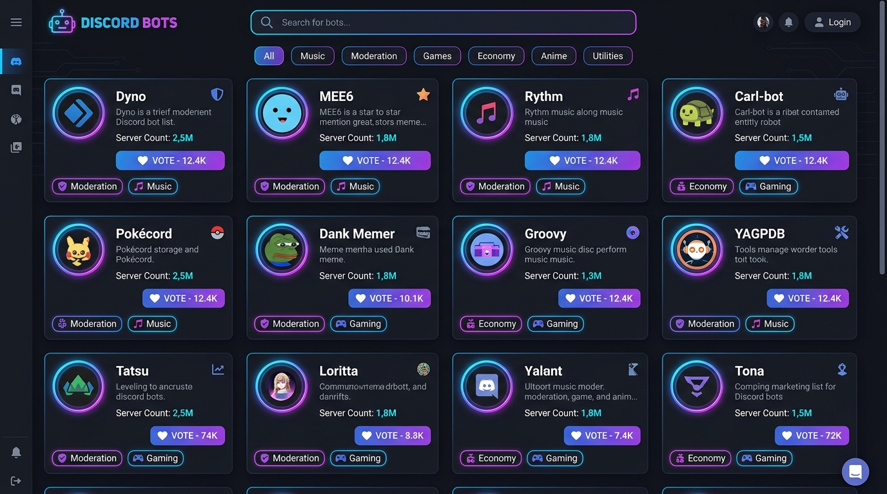
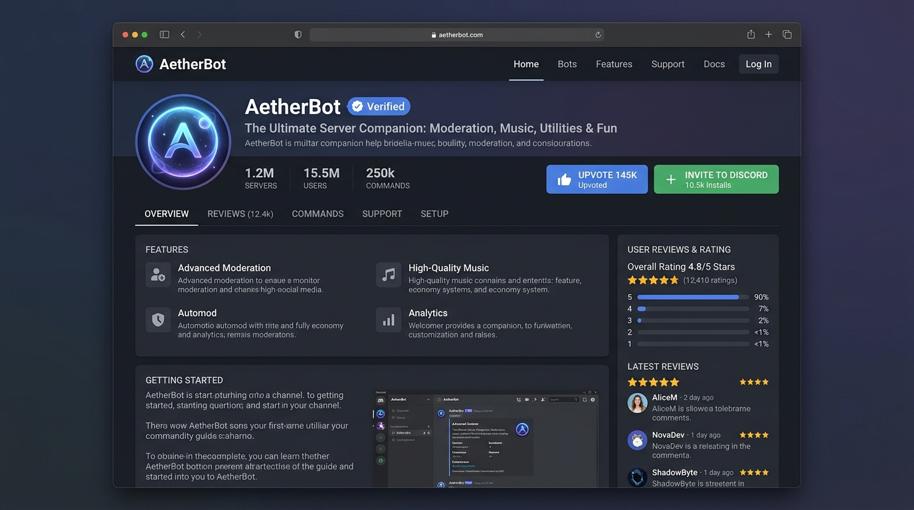

# 🤖 Discord Bot List Platform

Welcome to **Discord Bot List**, a modern web platform built to discover, invite, review, and promote Discord bots and communities.

---

## 📸 Platform Interface Screenshots

### 🏠 Home Page & Bot Explorer

### 🤖 Bot Profile & Review Page

---

## 🌟 Key Features

- 🔐 **Discord OAuth2 Login**: Quick & secure login using Discord accounts.
- ⚡ **Bot Listing & Search**: Instant filtering by categories (Moderation, Music, Gaming, Economy, AI).
- 🗳️ **Upvote & Review System**: User rating system and real-time upvotes for listed bots.
- 📊 **Admin Dashboard & Analytics**: Visitor statistics, bot approval queue, and management tools.
- 🛡️ **SEO & HTTPS Security**: Pre-configured meta tags, dynamic sitemaps, and SSL auto-redirection.

---

## 🏗️ Technology Stack

- **Backend Framework**: Express.js (Node.js)
- **Database**: MongoDB with Mongoose ODM
- **Templating Engine**: EJS (Embedded JavaScript)
- **Authentication**: Passport.js with Discord OAuth2 Strategy
- **Session Management**: Express-Session backed by MongoStore

---

## 🌐 Official Discord Community

Join our official Discord server for bot support, submission updates, and community chat:

[👉 Join Discord Community](https://discord.gg/1066224579342774302)

---

## 🔒 Source Code Privacy & License

> [!NOTE]
> This GitHub repository acts as the **Official Public Showcase**. To protect production security, live API secrets, and server infrastructure, the core backend source code is kept in private production environments.

---
Developed by **spidermanxfr**
